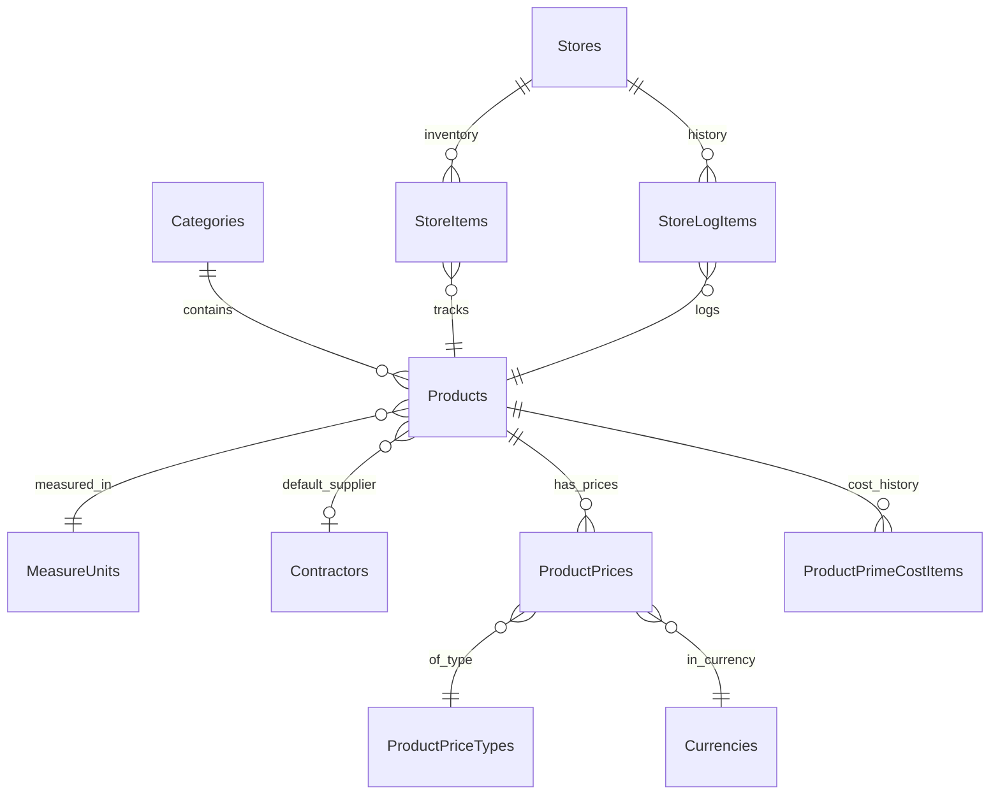

# Products Domain - Core Tables Schema Analysis

**Task:** TASK 1.3.1 - Phase 1: C# Code Analysis  
**Status:** ✅ COMPLETED (90% accuracy, pending SQL validation)  
**Date:** November 3, 2025

---

## 📁 Files in This Directory

| File | Size | Purpose | Status |
|------|------|---------|--------|
| **schema-draft.json** | 900 lines | Database schema extracted from C# code | 90% ✅ |
| **validation-queries.sql** | 10 queries | SQL scripts to fill schema gaps | Ready 🚀 |
| **PROGRESS.md** | Full report | Task log, findings, next steps | Complete 📋 |
| **README.md** | This file | Quick navigation guide | - |

---

## 🎯 Quick Start: What to Do Next

### Step 1: Run SQL Validation (5 minutes)

```bash
# Open SQL Server Management Studio
# Connect to: (your SQL Server with TEKA database)
# Open: validation-queries.sql
# Execute all queries (Ctrl+E)
# Export results to text or Excel
```

### Step 2: Start Next Chat Session

Copy this into your next chat:

```markdown
# TASK 1.3.2: Products Domain Schema - SQL Validation Phase

## Context
Completed C# analysis (90% accuracy). Need SQL validation to reach 100%.

## Input Files
- Previous analysis: C:\Users\SvetoslavPartenev\Documents\Teka_StoreNET_ERP\analysis\week1\core-tables\part-1-products\schema-draft.json
- SQL queries: validation-queries.sql (already executed)

## SQL Query Results
[PASTE YOUR SQL QUERY RESULTS HERE]

Query 1 (Products columns):
[paste here]

Query 2 (Products indexes):
[paste here]

... (continue for all 10 queries)

## Task
Use SQL results to:
1. Complete schema-draft.json → schema-final.json (100%)
2. Generate PostgreSQL DDL scripts
3. Extract business rules documentation
4. Create migration notes

## Output Location
C:\Users\SvetoslavPartenev\Documents\Teka_StoreNET_ERP\analysis\week1\core-tables\part-1-products\

START IMMEDIATELY.
```

---

## 📊 Schema Coverage

### Tables Analyzed (6):

✅ **Products** - 25 columns, 6 indexes, 10 FKs  
✅ **Categories** - 8 columns, 2 indexes, cascade delete  
✅ **Stores** - 13 columns, 5 child tables, complex ops  
✅ **MeasureUnits** - 4 columns, simple structure  
✅ **ProductPriceTypes** - 6 columns, many-to-many  
⚠️ **ProductPrices** - Structure uncertain (needs SQL)

### Gaps Needing SQL Validation:

| Gap | Priority | Impact |
|-----|----------|--------|
| ProductPrices storage model | CRITICAL | Affects price query design |
| Decimal precision (PrimeCost, Price) | HIGH | Affects data migration |
| Complex index columns | HIGH | Affects query performance |
| FK cascade rules | MEDIUM | Affects delete operations |
| ImageData type (IMAGE vs VARBINARY) | MEDIUM | Affects migration script |

---

## 🧩 Key Schema Relationships



---

## 💡 Business Logic Highlights

**Products:**
- Cannot be inactivated if quantity > 0 in any store
- Composite products have assembly templates
- Prime cost auto-calculated from PrimeCostItems
- ImageData triggers ImageAvailable flag

**Stores:**
- Must be initiated before inventory operations
- Initiation is one-way (cannot un-initiate)
- All quantity changes are logged
- Request items for replenishment tracking

**Price Management:**
- Multiple price types per product
- Prices can be in different currencies
- Bulk operations: copy, change by %, convert currency
- 5 rounding strategies available

---

## 🔍 DataObjects.NET Patterns

This codebase uses **DataObjects.NET** (ORM from ~2008):

**Key Patterns Found:**
- `abstract` properties → Foreign keys
- `[Length(N)]` → VARCHAR(N)
- `[Indexed(Unique=true)]` → Unique constraint
- `[Contained]` → Cascade delete
- `[ItemType(typeof(T))]` → Child collection
- `[PairTo]` → Many-to-many junction table
- `[LoadOnDemand]` → Lazy loading hint
- `[SqlType]` → Type override

**Migration Challenge:**
- Must convert to **Entity Framework Core**
- Different attribute system ([Required], [MaxLength], etc.)
- Different relationship configuration (Fluent API)

---

## 📈 Next Task Dependencies

**Blocks:**
- TASK 1.3.3: Finances Domain Schema
- TASK 1.3.4: Documents Domain Schema
- TASK 2.1: Business Logic Extraction
- Week 2: Entity Framework Core Model Generation

**Requires:**
- SQL Server access to TEKA database
- SQL query results (from validation-queries.sql)

---

## ⚠️ Important Notes

1. **Do NOT modify production database** - all queries are SELECT-only
2. **PostgreSQL DDL will differ** - data types, indexes syntax
3. **Business rules in C# must move** - to .NET 8 validators
4. **Permissions are app-level** - not enforced in DB
5. **Some computed fields** - may need triggers or EF computed properties

---

## 🎓 Reference

**DataObjects.NET Docs:** http://dataobjects.net/  
**Entity Framework Core Migration Guide:** https://learn.microsoft.com/en-us/ef/core/  
**PostgreSQL Data Types:** https://www.postgresql.org/docs/current/datatype.html

---

*Generated by TASK 1.3.1 - C# Schema Analysis*  
*See PROGRESS.md for detailed analysis report*
